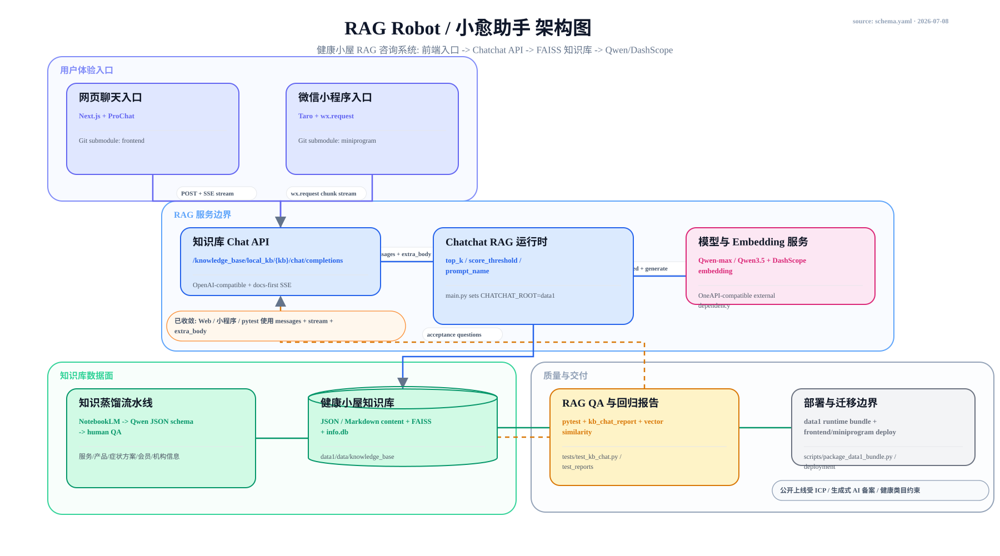

# RAG Robot / 小愈助手 Blueprint

## Architecture Diagram



Source of truth:
- `docs/architecture/schema.yaml`
- `docs/architecture/diagram.mmd`
- `docs/architecture/render.py`

Rendered views:
- `docs/architecture/diagram.svg`
- `docs/architecture/diagram.html`
- `docs/architecture/diagram.png`

Frontend adapter subview:
- `docs/architecture/frontend_adapters/schema.yaml`
- `docs/architecture/frontend_adapters/diagram.svg`
- `docs/architecture/frontend_adapters/diagram.png`
- `docs/architecture/frontend_adapters/diagram.html`
- `docs/architecture/frontend_adapters/diagram.mmd`

## Positioning

RAG Robot is a health-house consultation system. Users enter through the web chat or WeChat Mini Program, requests cross the Chatchat OpenAI-compatible API boundary, the RAG runtime retrieves structured health-house knowledge from `data1`, and Qwen/DashScope provide generation and embedding services.

## Modules

| Module | Responsibility | Input | Output | Non-goals |
| --- | --- | --- | --- | --- |
| Web chat入口 | Browser-facing chat UX, streaming display, quick questions, voice controls | User messages | SSE-rendered assistant text | Owns no knowledge data |
| 微信小程序入口 | WeChat runtime adapter with chunked stream handling and Markdown rendering | User messages | Mini Program chat messages | Does not define RAG policy |
| Knowledge Base Chat API | HTTP boundary for chat completions and retrieved docs | `messages`, model, RAG params | OpenAI-compatible JSON/SSE | Should not hide parameter contract drift |
| Chatchat RAG运行时 | Retrieval, prompt selection, score thresholding, response assembly | API payload + `CHATCHAT_ROOT` config | Retrieved docs + generated answer | Does not author source knowledge |
| 知识蒸馏流水线 | Convert raw materials into structured, reviewed knowledge records | Raw PDFs/Word/price/SOP content | Curated JSON/Markdown | AI output is not medical validation |
| 健康小屋知识库 | Durable retrieval plane: source content, FAISS vector store, DB metadata | Curated content + embeddings | Retrieval candidates and source docs | Binary vector store should not be Git truth |
| 模型与Embedding服务 | External generation and embedding dependency | Prompt text / document chunks | Chat completion / vectors | Not controlled by repo code |
| RAG QA与回归报告 | Acceptance questions, vector checks, HTML/JSON reports | Running API + expected elements | Test verdicts and evidence | Keyword tests alone are not full safety validation |
| 部署与迁移边界 | Runtime bundle, frontend/miniprogram deployment, backend hosting handoff | Code + `data1` runtime bundle | Deployed service/client artifacts | Public launch compliance is outside pure engineering |

## Key Contracts

- Parent repo to frontend modules: `frontend` and `miniprogram` are Git submodules recorded as `160000` gitlinks. Frontend changes must be committed inside the child repo first, then the parent pointer updated intentionally.
- Client to API: `POST /knowledge_base/local_kb/{kb}/chat/completions` with the shared payload shape `model + messages + stream + extra_body`.
- API to RAG runtime: `messages` and `stream` stay at the OpenAI-compatible top level; RAG controls (`top_k`, `score_threshold`, `temperature`, `prompt_name`, `return_direct`) stay under `extra_body`.
- Knowledge pipeline to knowledge store: manually reviewed JSON/Markdown records for services, products, symptom solutions, membership rules, and organization info.
- RAG runtime to knowledge store: vector retrieval over FAISS plus source document references.
- QA to API/store: acceptance cases should verify answer content, retrieval evidence, and boundary behavior.

## Design Choices

- Keep raw knowledge processing separate from runtime retrieval: NotebookLM/Qwen-assisted distillation is an offline data-preparation path, not a live user-facing agent.
- Keep `data1` as the runtime knowledge/config root while treating vector store binaries and DB files as migration artifacts, not normal code review material.
- Treat web and mini program as separate client adapters because their stream handling differs materially.
- Treat `frontend` and `miniprogram` as independent submodule delivery boundaries, not ordinary folders. Their code review, commit history, remotes, and release readiness must be checked inside each child repo.
- Keep model providers outside the system boundary; failures and parameter changes should be surfaced through QA reports and configuration.

## Submodule Workflow

When frontend work is involved, inspect all three Git states:

```bash
git -C E:\project\aibot status --short --ignore-submodules=none
git -C E:\project\aibot\frontend status --short --branch
git -C E:\project\aibot\miniprogram status --short --branch
```

Use this order for changes:

1. Commit and push `frontend` changes inside `E:\project\aibot\frontend`.
2. Commit and push `miniprogram` changes inside `E:\project\aibot\miniprogram`.
3. Return to `E:\project\aibot` and commit the updated submodule gitlink pointers only after the child repos are intentionally at the desired commits.

Do not treat `m frontend` or `M miniprogram` in the parent status as enough evidence of what changed. It only says the child worktree or pinned gitlink changed; the actual diff lives inside the submodule.

## Current Gaps

- The web client, mini program, and pytest configs now share the `messages + stream + extra_body` RAG payload shape at their request call sites. Remaining risk: this contract is still duplicated across TypeScript and pytest rather than generated from one shared cross-language schema.
- Current submodule state should be cleaned before release: `frontend` is ahead of origin by 1 commit, `miniprogram` is ahead of origin by 12 commits, and the parent repo sees the `miniprogram` submodule pointer as drifted from the recorded commit.
- `main.py` currently mixes path validation, path repair, environment setup, optional tunnel startup, and service startup; this should be split before the project becomes a reusable deployment baseline.
- RAG QA now includes payload contract checks, retrieval-source evidence parsing/reporting, configurable score gates (`KB_CHAT_REQUIRE_SIMILARITY_SCORES`, `KB_CHAT_MIN_SIMILARITY_SCORE`, `KB_CHAT_MIN_AVG_SIMILARITY_SCORE`), and a health/medical boundary guard. Remaining QA gap: live backend integration cases still need a reachable KB service and real samples to choose stable score thresholds.
- The PNG is rendered from the deterministic SVG. It is a first-pass blueprint visual, not a hand-polished presentation poster.
